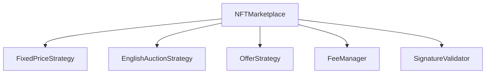

# Vesta NFT Marketplace Contracts

A robust, modular, and extensible NFT marketplace protocol built on EVM-compatible blockchains. The protocol supports multiple trading strategies including fixed price sales, English auctions, and offers, with the ability to easily add new custom trading strategies.

## Architecture

The marketplace uses a modular architecture with strategy pattern implementation:



### Core Components

- **NFTMarketplace.sol**: Main contract handling orders, payments, and royalties
- **Strategy Contracts**:
  - `FixedPriceStrategy.sol`: Direct buy/sell listings
  - `EnglishAuctionStrategy.sol`: English-style auctions
  - `OfferStrategy.sol`: Offers and counter-offers
- **Support Contracts**:
  - `FeeManager.sol`: Protocol fee management
  - `SignatureValidator.sol`: Order signature validation
  - `MarketplaceLib.sol`: Utility functions for NFT and payment handling

## Trading Flows

### Fixed Price Sales
1. Seller approves marketplace for NFT transfer
2. Seller creates listing with fixed price and duration
3. Buyer purchases NFT at listed price
4. NFT and payment are automatically transferred

### English Auctions
1. Seller sets reserve price and auction duration
2. Bidders place increasingly higher bids
3. Highest bid at auction end wins
4. Winner claims NFT after auction concludes

### Offer System
1. Buyer makes offer for specific NFT
2. Seller can accept, decline, or counter-offer
3. If accepted, NFT and payment transfer automatically
4. Offers expire after set duration

## Available Strategies

### 1. Fixed Price Strategy
- Direct buy/sell mechanism
- Instant settlement
- Supports both ETH and ERC20 payments
- Configurable listing duration

### 2. English Auction Strategy
- Traditional ascending price auction
- Configurable:
  - Reserve price
  - Minimum bid increment
  - Auction duration
  - Start time
- Automatic bid refunds
- Winner claim system

### 3. Offer Strategy
- Make offers on any NFT
- Counter-offer support
- Escrow system for offer amounts
- Configurable validity period

## Technical Features

### Security
- EIP-712 signature validation
- Reentrancy protection
- Access control system
- Secure fund handling
- Automated escrow management

### Extensibility
- Modular strategy system
- Custom strategy support
- Upgradeable contracts
- Flexible fee structure

### Standards Support
- ERC721 and ERC1155 NFTs
- ERC20 payments
- ERC2981 royalties
- MetaTransactions (EIP-2771)

## Development

### Prerequisites
- Node.js
- Hardhat
- Ethers.js

### Installation
```bash
npm install
```

### Testing
```bash
npm test
```

### Deployment
```bash
npm run deploy
```

## Integration

### Smart Contract Integration
```solidity
interface IMarketplaceStrategy {
    function validate(bytes calldata signature, Order calldata order) external view returns (bool);
    function execute(Order calldata order) external payable returns (bool);
}
```

### Order Structure
```solidity
struct Order {
    address maker;
    address taker;
    uint256 expiry;
    uint256 nonce;
    address nftContract;
    uint256 tokenId;
    uint256 quantity;
    uint256 price;
    address paymentToken;
    bytes32 strategyId;
    bytes params;
}
```

## Events
```solidity
event OrderExecuted(
    bytes32 indexed orderHash,
    address indexed maker,
    address indexed taker,
    Order order
);

event OfferCreated(
    bytes32 indexed offerId,
    address indexed offerer,
    address nftContract,
    uint256 tokenId
);

event AuctionCreated(
    bytes32 indexed auctionId,
    address indexed seller,
    address nftContract,
    uint256 tokenId
);
```

## License

MIT

## Contributing

Contributions are welcome! Please read our contributing guidelines before submitting PRs.
