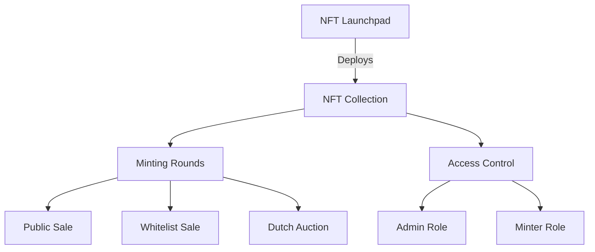

# NFT Launchpad - User Guide

A comprehensive guide for deploying and managing NFT collections using the NFT Launchpad.

## Table of Contents
1. [Overview](#overview)
2. [Creating an NFT Collection](#creating-an-nft-collection)
3. [Managing Mint Rounds](#managing-mint-rounds)
4. [Whitelist Implementation](#whitelist-implementation)
5. [Dutch Auction Setup](#dutch-auction-setup)
6. [Best Practices](#best-practices)

## Overview

NFT Launchpad is a factory contract system that allows you to:
- Deploy NFT collections with deterministic addresses (CREATE2)
- Configure multiple minting rounds
- Support whitelisted minting with Merkle trees
- Implement Dutch auctions
- Manage role-based access control



## Creating an NFT Collection

### 1. Initialize Contract Connection

```typescript
import { ethers } from 'ethers';

// Connect to provider
const provider = new ethers.JsonRpcProvider('YOUR_RPC_URL');
const signer = await provider.getSigner();

// Initialize launchpad contract
const launchpad = new ethers.Contract(
    'LAUNCHPAD_ADDRESS',
    launchpadABI,
    signer
);
```

### 2. Deploy Collection

```typescript
// Prepare deployment parameters
const params = {
    name: "My NFT Collection",
    symbol: "MNFT",
    baseURI: "ipfs://QmYourBaseURI/",
    maxSupply: 10000,
    owner: "0xYourAddress",
    salt: ethers.randomBytes(32),
    rounds: [{
        startTime: Math.floor(Date.now() / 1000) + 3600, // 1 hour from now
        endTime: Math.floor(Date.now() / 1000) + 7200,   // 2 hours from now
        price: ethers.parseEther("0.1"),
        maxSupply: 1000,
        merkleRoot: ethers.ZeroHash,
        isWhitelistEnabled: false
    }]
};

// Deploy collection
const tx = await launchpad.deployCollectionWithRounds(
    params.name,
    params.symbol,
    params.baseURI,
    params.maxSupply,
    params.owner,
    params.salt,
    params.rounds
);

const receipt = await tx.wait();
const event = receipt.logs.find(log => log.fragment.name === 'CollectionDeployed');
const collectionAddress = event.args[0];
```

## Managing Mint Rounds

Different types of rounds can be configured for your NFT collection:

### 1. Basic Public Sale

```typescript
const publicSale = {
    startTime: Math.floor(Date.now() / 1000) + 3600,
    endTime: Math.floor(Date.now() / 1000) + 86400,    // 24 hours duration
    price: ethers.parseEther("0.1"),
    maxSupply: 5000,
    merkleRoot: ethers.ZeroHash,
    isWhitelistEnabled: false
};

const collection = new ethers.Contract(collectionAddress, collectionABI, signer);
await collection.createRound(
    publicSale.startTime,
    publicSale.endTime,
    publicSale.price,
    publicSale.maxSupply,
    publicSale.merkleRoot,
    publicSale.isWhitelistEnabled
);
```

### 2. Multiple Round Structure

```typescript
const roundSchedule = [
    {
        name: "Whitelist Sale",
        duration: 24 * 3600,
        price: "0.08",
        supply: 1000,
        whitelisted: true
    },
    {
        name: "Public Sale",
        duration: 48 * 3600,
        price: "0.1",
        supply: 5000,
        whitelisted: false
    }
];

let startTime = Math.floor(Date.now() / 1000) + 3600;

for (const round of roundSchedule) {
    await collection.createRound(
        startTime,
        startTime + round.duration,
        ethers.parseEther(round.price),
        round.supply,
        round.whitelisted ? merkleRoot : ethers.ZeroHash,
        round.whitelisted
    );
    startTime += round.duration;
}
```

## Whitelist Implementation

### 1. Create Merkle Tree

```typescript
import { StandardMerkleTree } from "@openzeppelin/merkle-tree";

function setupWhitelist(addresses: string[]) {
    // Create tree with addresses
    const tree = StandardMerkleTree.of(
        addresses.map(addr => [addr]),
        ["address"]
    );
    
    // Generate proof map for each address
    const proofs = new Map();
    for (const [i, v] of tree.entries()) {
        proofs.set(v[0], tree.getProof(i));
    }
    
    return {
        root: tree.root,
        proofs
    };
}

// Usage
const whitelist = setupWhitelist([
    "0x123...",
    "0x456...",
    "0x789..."
]);
```

### 2. Implement Whitelisted Round

```typescript
const whitelistRound = {
    startTime: Math.floor(Date.now() / 1000) + 3600,
    endTime: Math.floor(Date.now() / 1000) + 86400,
    price: ethers.parseEther("0.08"),
    maxSupply: 1000,
    merkleRoot: whitelist.root,
    isWhitelistEnabled: true
};

await collection.createRound(
    whitelistRound.startTime,
    whitelistRound.endTime,
    whitelistRound.price,
    whitelistRound.maxSupply,
    whitelistRound.merkleRoot,
    whitelistRound.isWhitelistEnabled
);
```

## Dutch Auction Setup

Dutch auctions automatically decrease the price over time until someone buys or the minimum price is reached.

```typescript
function createDutchAuction(params: {
    startTime: number;
    duration: number;
    startPrice: string;
    endPrice: string;
    supply: number;
    steps: number;
}) {
    const rounds = [];
    const priceStart = ethers.parseEther(params.startPrice);
    const priceEnd = ethers.parseEther(params.endPrice);
    const stepDuration = Math.floor(params.duration / params.steps);
    const priceDecrement = (priceStart - priceEnd) / params.steps;
    
    for (let i = 0; i < params.steps; i++) {
        rounds.push({
            startTime: params.startTime + (i * stepDuration),
            endTime: params.startTime + ((i + 1) * stepDuration),
            price: priceStart - (priceDecrement * BigInt(i)),
            maxSupply: Math.floor(params.supply / params.steps),
            merkleRoot: ethers.ZeroHash,
            isWhitelistEnabled: false
        });
    }
    
    return rounds;
}

// Example usage
const dutchAuctionParams = {
    startTime: Math.floor(Date.now() / 1000) + 3600,
    duration: 12 * 3600, // 12 hours
    startPrice: "0.5",   // 0.5 ETH
    endPrice: "0.1",     // 0.1 ETH
    supply: 1000,
    steps: 12            // Price drops every hour
};

const auctionRounds = createDutchAuction(dutchAuctionParams);

// Deploy rounds
for (const round of auctionRounds) {
    await collection.createRound(
        round.startTime,
        round.endTime,
        round.price,
        round.maxSupply,
        round.merkleRoot,
        round.isWhitelistEnabled
    );
}
```

## Best Practices

### 1. Deployment Checklist
- ✓ Verify all parameters before deployment
- ✓ Test salt values with `computeAddress`
- ✓ Ensure proper role configuration
- ✓ Double-check timestamps and durations
- ✓ Verify merkle root if using whitelist

### 2. Round Management
- Add buffer time between rounds (15-30 minutes recommended)
- Monitor gas prices for optimal deployment timing
- Set reasonable price points based on market research
- Keep round durations moderate (24-48 hours typical)

### 3. Security Considerations
- Always use fresh salt values
- Verify merkle proofs off-chain before minting
- Implement proper role separation
- Monitor contract events
- Test thoroughly on testnet first

### 4. Gas Optimization
- Batch operations when possible
- Consider gas costs in round structure
- Use appropriate array sizes
- Test during different network conditions

### 5. Error Handling
```typescript
try {
    await collection.mint(roundId, quantity, merkleProof, {
        value: price * quantity
    });
} catch (error) {
    if (error.message.includes("Round not active")) {
        console.log("This round is not currently active");
    } else if (error.message.includes("Insufficient payment")) {
        console.log("Please send the correct amount of ETH");
    } else if (error.message.includes("Invalid proof")) {
        console.log("Address not whitelisted for this round");
    } else {
        console.error("Unexpected error:", error);
    }
}
```

Remember to always test your deployment and minting processes on a testnet before moving to mainnet. Keep track of all deployed addresses and maintain clear documentation of your round structure and timing.

For additional support or questions, please refer to the contract documentation or reach out to the development team.